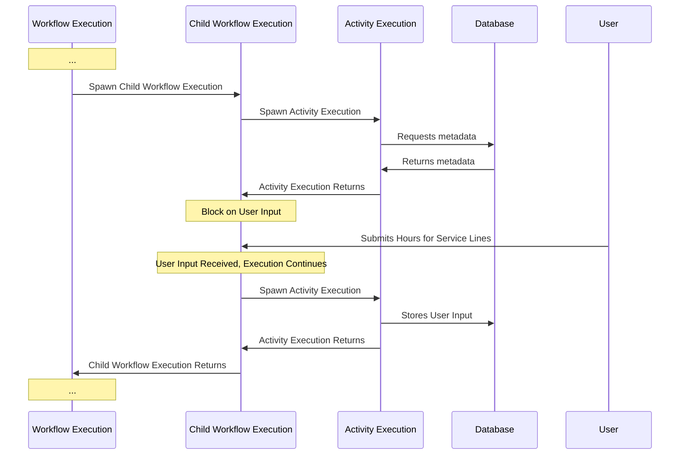

# What is this?

This project is a toy example showcasing how [Temporal](https://docs.temporal.io/) could be used effectively as a backend for a long lived form that requires actions to be taken at various stages of completeness. 

Anyway, this project has five parts:

## The cluster

https://docs.temporal.io/clusters

to start go to`/temporal-server` and `docker compose up`

## The "microservice"

This bit is meant to simulate an external call to another service in a real application. It could be persisting data, triggering something, who knows. In this case it gets a greeting in Spanish or a farewell in Spanish. This was from the free temporal 101 course, which I highly recommend for wrapping your head around all this. 

`go run greeting-and-farewell-service.go`

## The worker

The worker actually does the work. Simple as that. You need to register the work that is possible to do and then register the worker with the cluster. The cluster will send work to workers that are available and are registered as capable. 

go into `workflow` and run `go run worker/main.go`

## The server-client

The server accepts requests from the front end and handles them via the client.

go into `workflow` and run `go run server-client/main.go`

## The front end

Don't judge me :/. This is just used to send/get stuff from the server-client. Make sure to install stuff first (`npm install`).

go into `form` and `npm run dev -- --open`

### Example Sequence Diagram 

This diagram provides an example of how this might work in practice without needing to read all the code here. The core idea is that we have workflows with child workflows and activities that persist data (or just generally have external deps). 

